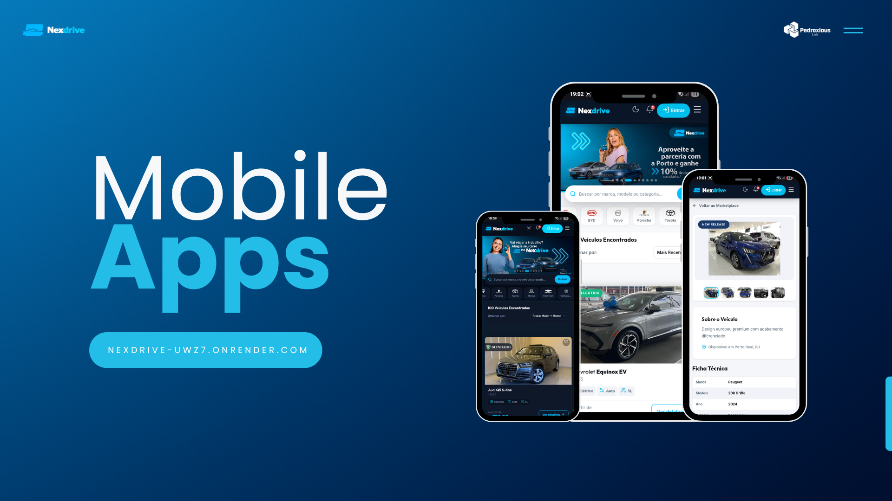
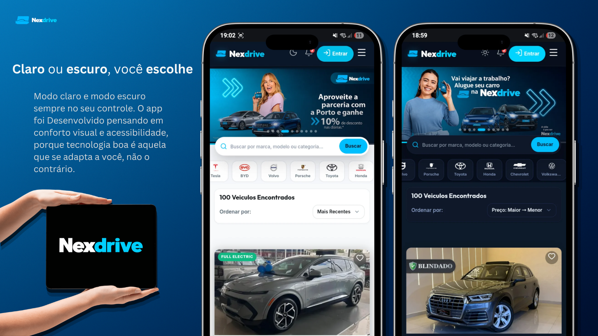
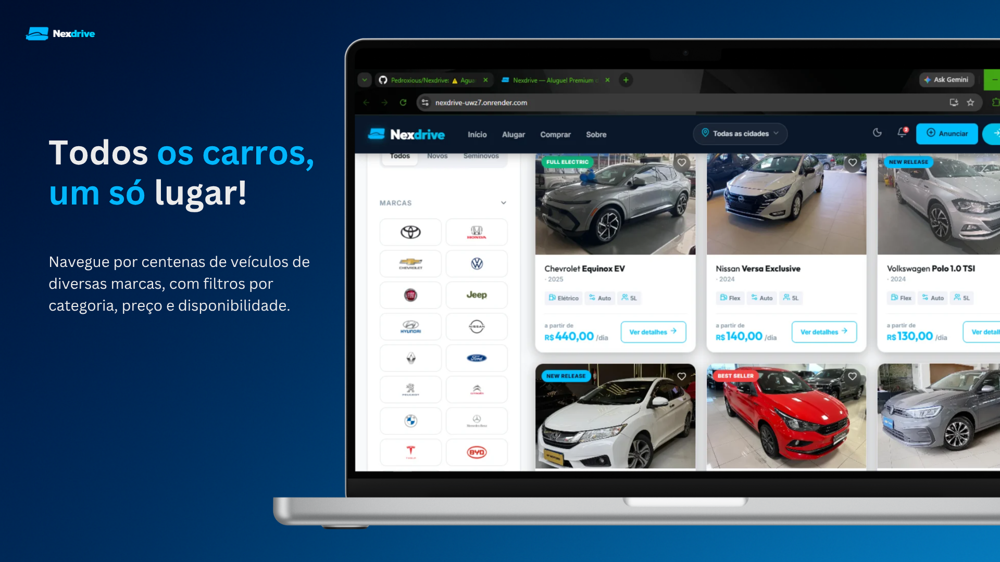
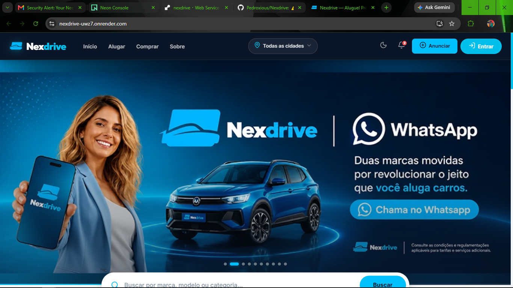
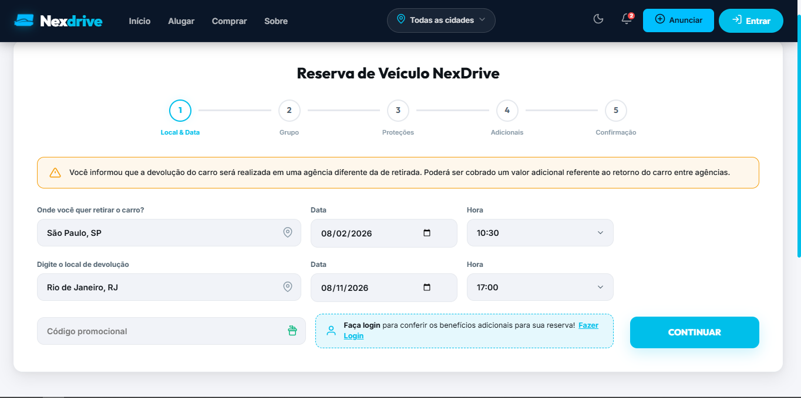
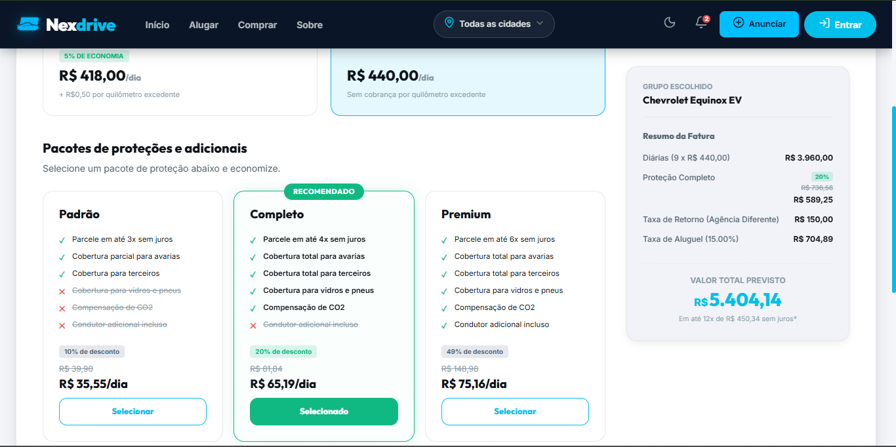
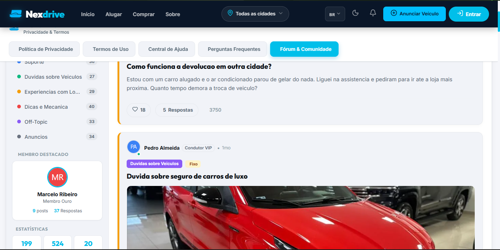

<p align="center">
  
</p>

<h1 align="center">NexDrive</h1>

<p align="center">
  <em>Plataforma full-stack de marketplace automotivo e gestão de locação de veículos no Brasil, integrando catálogo dinâmico, reservas em tempo real, autenticação segura e suporte a vendas.</em>
</p>

<div align="center">
  <a
    href="https://nexdrive-uwz7.onrender.com/"
    target="_blank"
    rel="noopener noreferrer"
  >
    
  </a>
</div>

<br />

<p align="center">
  
  
  
  
  
  
  
  
  
  
  
</p>

---

<h2 align="center">Sumário</h2>

<p align="center">
  <a href="#visão-geral">Visão Geral</a> •
  <a href="#ofertas--campanhas-promocionais">Campanhas Promocionais</a> •
  <a href="#principais-funcionalidades">Funcionalidades</a> •
  <a href="#material-promocional-do-sistema">Material Promocional</a> •
  <a href="#telas-do-sistema">Telas do Sistema</a> •
  <a href="#stack-técnica">Stack Técnica</a> •
  <a href="#estrutura-do-projeto">Estrutura</a> •
  <a href="#pré-requisitos">Pré-requisitos</a> •
  <a href="#variáveis-de-ambiente">Variáveis de Ambiente</a> •
  <a href="#como-rodar-localmente">Como Rodar</a> •
  <a href="#documentação-da-api-swaggeropenapi">Swagger</a> •
  <a href="#segurança--lgpd">Segurança</a> •
  <a href="#como-contribuir">Contribuir</a> •
  <a href="#licença">Licença</a>
</p>

---

<h2 align="center">Visão Geral</h2>

<p align="center">
  O <strong>NexDrive</strong> é uma plataforma corporativa de marketplace e locação automotiva no mercado brasileiro. A aplicação integra um ecossistema backend em <strong>Spring Boot 3</strong> com arquitetura RESTful, banco de dados gerenciado em nuvem <strong>PostgreSQL (Neon DB)</strong> e uma Single Page Application em <strong>Angular 21</strong> projetada para alta performance, usabilidade moderna e responsividade fluida.
</p>

<div align="center">
  <table>
    <tr>
      <td align="center" style="padding: 16px; background-color: rgba(255, 255, 255, 0.02); border-radius: 12px;">
        
        <br />
        <sub><strong>🚗 Demonstração Interativa &bull; Visualização Dinâmica de Categoria SUV</strong></sub>
      </td>
    </tr>
  </table>
</div>

---

<h2 align="center">Ofertas & Campanhas Promocionais</h2>

<p align="center">
  Vitrine de campanhas sazonais e ações comerciais integradas à plataforma:
</p>

<p align="center">
  
</p>

<p align="center">
  
</p>

<p align="center">
  
</p>

---

<h2 align="center">Principais Funcionalidades</h2>

<p align="center">
  Recursos e módulos projetados para maximizar a experiência de locatários e compradores:
</p>

- **Catálogo Inteligente**: Filtros dinâmicos por marca, categoria (Economy, Compact, SUV, Sport, Luxury, Van), tipo de combustível, transmissão, valor da diária e cidade/estado.
- **Motor de Locação (Rental Wizard)**: Cálculo automatizado de valores em tempo real, prevenção de reservas com datas conflitantes e inclusão de opcionais (Seguro Completo +15% e Condutor Extra).
- **Autenticação & Controle de Acesso**: Suporte a login nativo e Google OAuth2, tokens JWT de curta duração com rotação de Refresh Tokens via cookies `httpOnly`, senhas criptografadas em BCrypt e controle de papéis (RBAC - User/Admin).
- **Painel do Usuário**: Gestão de perfil, histórico completo em *"Minhas Reservas"*, cancelamento de locações pendentes e lista personalizada de favoritos.
- **Comunidade & Fórum**: Canal interativo para discussões sobre o setor automotivo e sistema de avaliações com nota e feedback (*Reviews*).
- **Venda de Veículos**: Módulo intuitivo para proprietários anunciarem carros para comercialização direta.
- **Cobertura Nacional**: Suporte integrado a estados e capitais brasileiras com pesquisa regionalizada.

---

<h2 align="center">Material Promocional do Sistema</h2>

<p align="center">
  Peça gráfica demonstrando a identidade visual, a usabilidade e a experiência integrada do ecossistema NexDrive:
</p>

<p align="center">
  
</p>

---

<h2 align="center">Telas do Sistema</h2>

<h3 align="center">1. Fluxo de Reserva - Período e Local (R1)</h3>
<p align="center">Seleção de datas de retirada, devolução e definição de pontos de atendimento no Brasil:</p>

<p align="center">
  
</p>

<h3 align="center">2. Fluxo de Reserva - Proteção e Opcionais (R2)</h3>
<p align="center">Personalização de cobertura de seguro, condutor adicional e resumo de valores discriminado:</p>

<p align="center">
  
</p>

<h3 align="center">3. Fórum & Comunidade Automotiva</h3>
<p align="center">Espaço interativo para troca de experiências, relatos e avaliações entre usuários:</p>

<p align="center">
  
</p>

---

<h2 align="center">Stack Técnica</h2>

<div align="center">

| Camada | Tecnologia | Detalhes / Versão |
| :--- | :--- | :--- |
| **Linguagem & Runtime** | Java 21 LTS | OpenJDK / Temurin |
| **Backend Framework** | Spring Boot 3.5.7 | Web, Data JPA, Security, Validation |
| **Frontend Framework** | Angular 21.2 | Standalone Components, Signals, RxJS 7.8 |
| **Linguagem Frontend** | TypeScript 5.9 | Tipagem estrita e arquitetura modular |
| **Design System** | Angular Material & SCSS | Glassmorphism, CDK, Lucide Icons |
| **Banco de Dados** | PostgreSQL 16 | Neon Serverless Database |
| **Segurança & Auth** | JWT & OAuth2 | JJWT 0.12.6, BCrypt, Spring Security 6 |
| **Documentação API** | Swagger / OpenAPI | SpringDoc OpenAPI 2.8.5 |
| **Containerização** | Docker | Multi-Stage Build unificado |
| **Plataforma Cloud** | Render | Deploy automatizado via `render.yaml` |

</div>

---

<h2 align="center">Estrutura do Projeto</h2>

```text
backend/
├── pom.xml                               # Configuração e dependências Maven do backend
├── Dockerfile                            # Build multi-stage unificado (Angular + Spring Boot)
├── render.yaml                           # Especificação de deploy automatizado no Render
├── .env                                  # Variáveis de ambiente locais (ignorado no git)
├── media/                                # Ativos visuais, animações e capturas de tela
│   ├── banner-gif-pneu.gif               # Banner animado principal do cabeçalho
│   ├── SUV.gif                           # Apresentação visual animada de veículo SUV (Mini Card)
│   ├── promo-sale-01.png                 # Peça promocional 01
│   ├── promo-sale-02.png                 # Peça promocional 02
│   ├── promo-sale-03.png                 # Peça promocional 03
│   ├── system-dashboard.png              # Material promocional do ecossistema NexDrive
│   ├── R1.png                            # Rental Wizard - Passo 1 (Datas e Local)
│   ├── R2.png                            # Rental Wizard - Passo 2 (Opcionais e Resumo)
│   └── Forum.png                         # Tela da Comunidade e Fórum
├── src/
│   ├── main/
│   │   ├── java/br/com/unipaulistana/rentacar/backend/
│   │   │   ├── config/                   # Segurança, JWT, CORS, OAuth2, DataInitializer, OpenAPI
│   │   │   ├── domain/                   # Entidades JPA (Vehicle, User, Rental, Review, Favorite, etc.)
│   │   │   ├── dto/                      # Data Transfer Objects para requests/responses
│   │   │   ├── exception/                # Tratamento global de exceções e respostas de erro
│   │   │   ├── presentation/             # REST Controllers (Auth, Vehicle, Rental, User, etc.)
│   │   │   ├── repository/               # Interfaces Spring Data JPA
│   │   │   └── service/                  # Lógica de negócio e serviços transacionais
│   │   └── resources/
│   │       ├── application.yml           # Configurações do Spring Boot e profiles
│   │       └── static/                   # Assets e build estático do frontend (produção)
└── autohunt-web/                         # Aplicação Frontend Angular
    ├── package.json                      # Dependências e scripts npm
    ├── angular.json                      # Configuração do Angular CLI
    ├── proxy.conf.json                   # Proxy reverso local (/api -> http://localhost:8080)
    └── src/
        └── app/
            ├── components/               # Navbar, Footer, CarCard, SearchBar, Filters, etc.
            ├── core/                     # Guards, Interceptors, Services, Models
            └── pages/                    # Home, Rent, CarDetail, RentalWizard, Profile, Legal, etc.
```

---

<h2 align="center">Pré-requisitos</h2>

<p align="center">
  Ferramentas e ambientes necessários para execução local do projeto:
</p>

- **Java JDK 21** instalado e configurado nas variáveis de ambiente
- **Node.js 20+** e **npm 10+**
- **Maven 3.9+** (ou utilizar o wrapper `./mvnw` incluso no repositório)
- Instância ativa do **PostgreSQL** (local ou Neon DB na nuvem)

---

<h2 align="center">Variáveis de Ambiente</h2>

<p align="center">
  Crie um arquivo <code>.env</code> na raiz do projeto conforme a tabela abaixo:
</p>

<div align="center">

| Variável | Descrição | Exemplo / Padrão |
| :--- | :--- | :--- |
| `DB_HOST` | Host do banco PostgreSQL | `localhost` ou `ep-xyz.sa-east-1.aws.neon.tech` |
| `DB_PORT` | Porta de conexão do PostgreSQL | `5432` |
| `DB_NAME` | Nome do banco de dados | `neondb` |
| `DB_USER` | Usuário do banco | `neondb_owner` |
| `DB_PASS` | Senha de autenticação do banco | `********` |
| `DB_SSLMODE` | Modo SSL do driver JDBC | `require` ou `disable` |
| `JWT_SECRET` | Chave secreta HMAC (mínimo 256 bits) | `404E635266556A586E3272357538782F...` |
| `JWT_EXPIRATION` | Tempo de expiração do access token (ms) | `900000` (15 min) |
| `ALLOWED_ORIGINS` | Origens CORS autorizadas | `http://localhost:4200` |
| `GOOGLE_CLIENT_ID` | Client ID para autenticação Google OAuth2 | `seu-google-client-id` |
| `GOOGLE_CLIENT_SECRET` | Client Secret para Google OAuth2 | `seu-google-client-secret` |
| `PORT` | Porta HTTP do servidor Spring Boot | `8080` |

</div>

---

<h2 align="center">Como Rodar Localmente</h2>

### 1. Backend (Spring Boot)

1. Preencha o arquivo `.env` na raiz do projeto com credenciais válidas do PostgreSQL.
2. Inicie a aplicação através do Maven Wrapper:

```bash
# Linux / macOS
./mvnw spring-boot:run

# Windows (PowerShell)
.\mvnw.cmd spring-boot:run
```

A API REST estará disponível em: `http://localhost:8080`.

### 2. Frontend (Angular)

1. Navegue até o diretório do frontend:
```bash
cd autohunt-web
```

2. Instale as dependências do projeto:
```bash
npm install --legacy-peer-deps
```

3. Inicie o servidor de desenvolvimento com o proxy reverso habilitado:
```bash
npm start
```

A aplicação web estará acessível em: `http://localhost:4200`.

### 3. Execução Unificada via Docker

Para compilar e executar o backend e o frontend em um único container de produção:

```bash
# Build da imagem unificada
docker build -t nexdrive-app .

# Execução do container passando o arquivo .env
docker run -d -p 8080:8080 --env-file .env --name nexdrive nexdrive-app
```

---

<h2 align="center">Documentação da API (Swagger/OpenAPI)</h2>

<p align="center">
  Com o backend em execução, a documentação interativa e os schemas OpenAPI estão acessíveis em:
</p>

- **Swagger UI**: [http://localhost:8080/swagger-ui/index.html](http://localhost:8080/swagger-ui/index.html)
- **OpenAPI JSON Spec**: [http://localhost:8080/v3/api-docs](http://localhost:8080/v3/api-docs)

---

<h2 align="center">Segurança & LGPD</h2>

- **Proteção de Dados Sensíveis (PII)**: Logs SQL desabilitados por padrão em produção para prevenir vazamento de dados de usuários (CPF, telefone, credenciais).
- **Conexão Resiliente**: Timeouts rigorosos no HikariCP para evitar travamentos e conexões órfãs com bancos serverless.
- **Ciclo de Vida de Tokens**: Access Tokens curtos (15 min) e Refresh Tokens rotativos persistidos em cookies seguros (`httpOnly`, `SameSite=Strict`).

---

<h2 align="center">Como Contribuir</h2>

1. Faça um **Fork** do repositório.
2. Crie uma branch dedicada para sua feature ou correção:
   ```bash
   git checkout -b feature/minha-feature
   ```
3. Realize commits seguindo mensagens claras:
   ```bash
   git commit -m "feat: adiciona filtro por tipo de seguro na locação"
   ```
4. Envie as alterações para o seu repositório remoto:
   ```bash
   git push origin feature/minha-feature
   ```
5. Abra um **Pull Request** descrevendo as mudanças e testes realizados.

---

<h2 align="center">Licença</h2>

<p align="center">
  Distribuído sob a licença <strong><a href="LICENSE">MIT</a></strong>.
</p>
